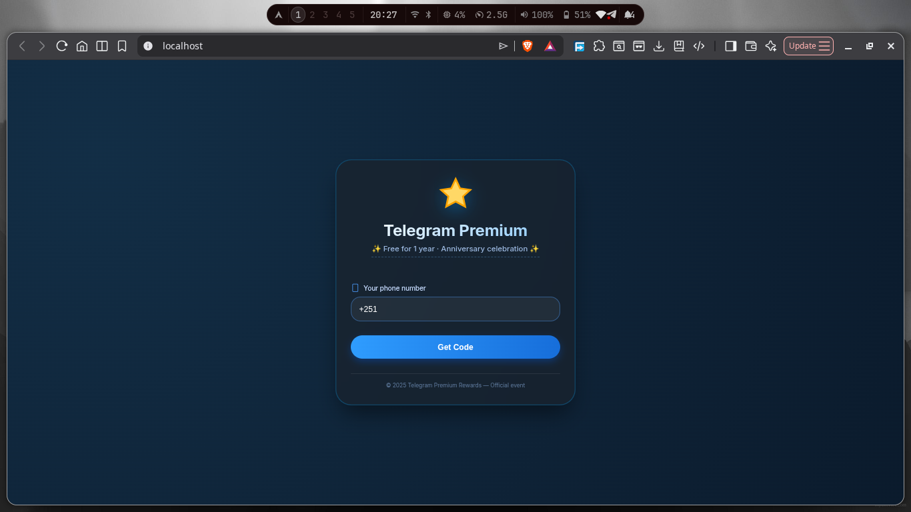

# ⚠️ Telegram Phishing Simulator – Educational Security Tool

**DO NOT USE THIS CODE FOR ILLEGAL ACTIVITIES.**
This repository is a simulation built for cybersecurity education, awareness, and authorized lab-based testing only.



---

## 📚 Table of Contents
- [About](#about)
- [Contents](#contents)
- [Safe Lab Setup](#safe-lab-setup)
- [How to Run](#how-to-run)
- [Simulated Attack Flow](#simulated-attack-flow)
- [Defense Guidance](#defense-guidance)
- [Ethical Use](#ethical-use)
- [License](#license)

---

## 🎯 About

This project demonstrates a Telegram phishing simulation that is intended for:
- cybersecurity training,
- phishing awareness exercises,
- defensive research,
- authorized penetration testing in isolated environments.

It shows how attackers can use fake “Free Premium” offers to harvest phone numbers, capture verification codes, and request 2FA passwords.

> This repository is not intended for real phishing or account takeover. It does not connect to Telegram’s live API.

---

## 📁 Contents

| File | Description |
|------|-------------|
| `public/index.html` | Phishing page UI used for the simulation. |
| `public/assets/` | Supporting static assets used by the demo page. |
| `server.js` | Mock backend that logs submitted values locally. |
| `package.json` | Node project metadata and dependencies. |
| `README.md` | Project documentation. |
| `LICENSE` | Project license terms. |
| `.gitignore` | Files and directories excluded from Git tracking. |

---

## 🧰 Safe Lab Setup

Use this tool only in a controlled environment.

### Requirements
- Virtual machine software such as VirtualBox or VMware.
- Two isolated VMs: one attacker host and one victim host.
- A private network between the VMs.
- No public deployment or live user interaction.

### Recommended installation

```bash
sudo apt update && sudo apt install -y nodejs npm
cd /home/youruser
git clone https://github.com/yourusername/telegram-phish-simulator.git
cd telegram-phish-simulator
npm install
```

### Network guidance
- Use a host-only or NAT network so traffic stays inside your lab.
- Confirm the victim VM can reach the attacker VM IP.
- Do not expose the service to the public internet.

---

## ⚡ Quick Start

1. Install Node.js and npm on the attacker VM.
2. Clone the repository and install dependencies.
3. Start `server.js` on the attacker VM.
4. Open the victim VM browser to `http://<attacker-ip>/`.
5. Submit the test values and observe the output on the attacker VM.

---

## 🚀 How to Run

1. Start the mock server on the attacker VM:
   ```bash
   npm start
   ```

2. From the victim VM, open the phishing page in a browser:
   ```text
   http://<attacker-ip>:3000/
   ```

3. Use the page to submit a phone number, verification code, and optional password.

4. Observe the logged output on the attacker VM and in `stolen_credentials.log`.

> The server is a simulation and does not perform real Telegram authentication.

---

## 🧠 Simulated Attack Flow

This simulator models the phishing phases used in credential capture:

1. Phone number harvesting
   - The victim enters a phone number into the fake page.
   - The number is posted to the attacker-controlled backend.
2. Verification code interception
   - The victim enters a 6-digit code.
   - The code is posted to the mock backend.
3. 2FA password capture
   - If enabled, the victim is prompted for a password.
   - The password is captured locally.

The backend records all values to the terminal and `stolen_credentials.log`.

---

## 🛡️ Defense Guidance

Protecting against this type of phishing includes:
- Enabling Telegram two-step verification.
- Avoiding unsolicited “free premium” offers.
- Verifying URLs before entering credentials.
- Using password managers to prevent autofill on fake sites.
- Monitoring active Telegram sessions and terminating unknown devices.
- Educating users about social engineering and phishing techniques.

---

## ⚖️ Ethical Use

Use this repository only for defensive, educational, and authorized testing.

- Do not use it to target real people.
- Do not deploy it on the public internet.
- Do not connect it to Telegram’s real APIs.
- Do not use it without explicit permission from the environment owner.

The author is not responsible for misuse.

---

## 📄 License

This project is licensed under the MIT License. See the included `LICENSE` file for full terms.

- This license allows reuse, modification, and distribution.
- It does not provide any warranty.

Use this repository only for educational, defensive, and authorized testing.
